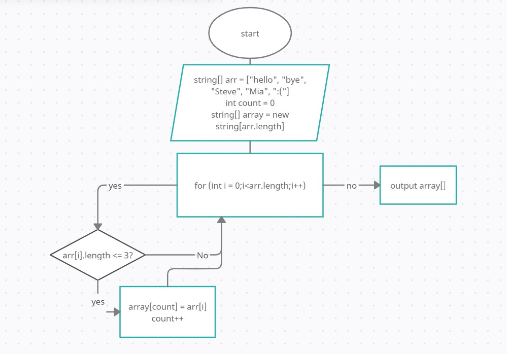

 

# Объяснение

Создаем массив arr как начальный массив

Cоздаем переменную count в качестве уникального счетчика для массива array

Создаем массив array

Объявляем цикл для перебора значений arr, затем каждое значение(колво символов элемента) сравниваем с установленным из условия значением. Если да,то записываем это значение в массив array,если нет , то прокручиваем цикл снова.

Ввыводим полученный массив